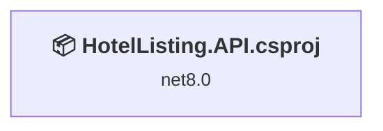
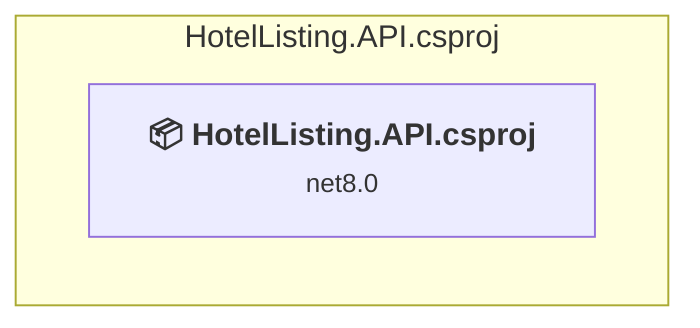

# Projects and dependencies analysis

This document provides a comprehensive overview of the projects and their dependencies in the context of upgrading to .NETCoreApp,Version=v9.0.

## Table of Contents

- [Executive Summary](#executive-Summary)
  - [Highlevel Metrics](#highlevel-metrics)
  - [Projects Compatibility](#projects-compatibility)
  - [Package Compatibility](#package-compatibility)
  - [API Compatibility](#api-compatibility)
- [Aggregate NuGet packages details](#aggregate-nuget-packages-details)
- [Top API Migration Challenges](#top-api-migration-challenges)
  - [Technologies and Features](#technologies-and-features)
  - [Most Frequent API Issues](#most-frequent-api-issues)
- [Projects Relationship Graph](#projects-relationship-graph)
- [Project Details](#project-details)

  - [HotelListing.API\HotelListing.API.csproj](#hotellistingapihotellistingapicsproj)

## Executive Summary

### Highlevel Metrics

| Metric | Count | Status |
| :--- | :---: | :--- |
| Total Projects | 1 | All require upgrade |
| Total NuGet Packages | 8 | 2 need upgrade |
| Total Code Files | 24 |  |
| Total Code Files with Incidents | 2 |  |
| Total Lines of Code | 926 |  |
| Total Number of Issues | 6 |  |
| Estimated LOC to modify | 3+ | at least 0.3% of codebase |

### Projects Compatibility

| Project | Target Framework | Difficulty | Package Issues | API Issues | Est. LOC Impact | Description |
| :--- | :---: | :---: | :---: | :---: | :---: | :--- |
| [HotelListing.API\HotelListing.API.csproj](#hotellistingapihotellistingapicsproj) | net8.0 | 🟢 Low | 2 | 3 | 3+ | AspNetCore, Sdk Style = True |

### Package Compatibility

| Status | Count | Percentage |
| :--- | :---: | :---: |
| ✅ Compatible | 6 | 75.0% |
| ⚠️ Incompatible | 0 | 0.0% |
| 🔄 Upgrade Recommended | 2 | 25.0% |
| ***Total NuGet Packages*** | ***8*** | ***100%*** |

### API Compatibility

| Category | Count | Impact |
| :--- | :---: | :--- |
| 🔴 Binary Incompatible | 1 | High - Require code changes |
| 🟡 Source Incompatible | 2 | Medium - Needs re-compilation and potential conflicting API error fixing |
| 🔵 Behavioral change | 0 | Low - Behavioral changes that may require testing at runtime |
| ✅ Compatible | 1194 |  |
| ***Total APIs Analyzed*** | ***1197*** |  |

## Aggregate NuGet packages details

| Package | Current Version | Suggested Version | Projects | Description |
| :--- | :---: | :---: | :--- | :--- |
| AutoMapper | 16.0.0 |  | [HotelListing.API.csproj](#hotellistingapihotellistingapicsproj) | ✅Compatible |
| Microsoft.AspNetCore.Identity.EntityFrameworkCore | 8.0.23 | 9.0.12 | [HotelListing.API.csproj](#hotellistingapihotellistingapicsproj) | NuGet package upgrade is recommended |
| Microsoft.EntityFrameworkCore | 9.0.12 |  | [HotelListing.API.csproj](#hotellistingapihotellistingapicsproj) | ✅Compatible |
| Microsoft.EntityFrameworkCore.Design | 9.0.12 |  | [HotelListing.API.csproj](#hotellistingapihotellistingapicsproj) | ✅Compatible |
| Microsoft.EntityFrameworkCore.SqlServer | 9.0.12 |  | [HotelListing.API.csproj](#hotellistingapihotellistingapicsproj) | ✅Compatible |
| Microsoft.EntityFrameworkCore.Tools | 9.0.12 |  | [HotelListing.API.csproj](#hotellistingapihotellistingapicsproj) | ✅Compatible |
| Microsoft.VisualStudio.Web.CodeGeneration.Design | 8.0.23 | 9.0.12 | [HotelListing.API.csproj](#hotellistingapihotellistingapicsproj) | NuGet package upgrade is recommended |
| Swashbuckle.AspNetCore | 6.6.2 |  | [HotelListing.API.csproj](#hotellistingapihotellistingapicsproj) | ✅Compatible |

## Top API Migration Challenges

### Technologies and Features

| Technology | Issues | Percentage | Migration Path |
| :--- | :---: | :---: | :--- |

### Most Frequent API Issues

| API | Count | Percentage | Category |
| :--- | :---: | :---: | :--- |
| T:Microsoft.Extensions.DependencyInjection.ServiceCollectionExtensions | 1 | 33.3% | Binary Incompatible |
| T:Microsoft.Extensions.DependencyInjection.IdentityEntityFrameworkBuilderExtensions | 1 | 33.3% | Source Incompatible |
| M:Microsoft.Extensions.DependencyInjection.IdentityEntityFrameworkBuilderExtensions.AddEntityFrameworkStores''1(Microsoft.AspNetCore.Identity.IdentityBuilder) | 1 | 33.3% | Source Incompatible |

## Projects Relationship Graph

Legend:
📦 SDK-style project
⚙️ Classic project

## Project Details

### HotelListing.API\HotelListing.API.csproj

#### Project Info

- **Current Target Framework:** net8.0
- **Proposed Target Framework:** net9.0
- **SDK-style**: True
- **Project Kind:** AspNetCore
- **Dependencies**: 0
- **Dependants**: 0
- **Number of Files**: 26
- **Number of Files with Incidents**: 2
- **Lines of Code**: 926
- **Estimated LOC to modify**: 3+ (at least 0.3% of the project)

#### Dependency Graph

Legend:
📦 SDK-style project
⚙️ Classic project

### API Compatibility

| Category | Count | Impact |
| :--- | :---: | :--- |
| 🔴 Binary Incompatible | 1 | High - Require code changes |
| 🟡 Source Incompatible | 2 | Medium - Needs re-compilation and potential conflicting API error fixing |
| 🔵 Behavioral change | 0 | Low - Behavioral changes that may require testing at runtime |
| ✅ Compatible | 1194 |  |
| ***Total APIs Analyzed*** | ***1197*** |  |

